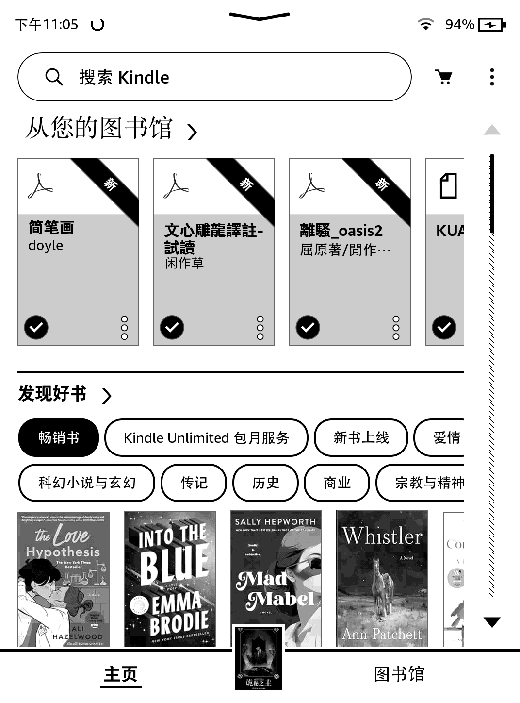
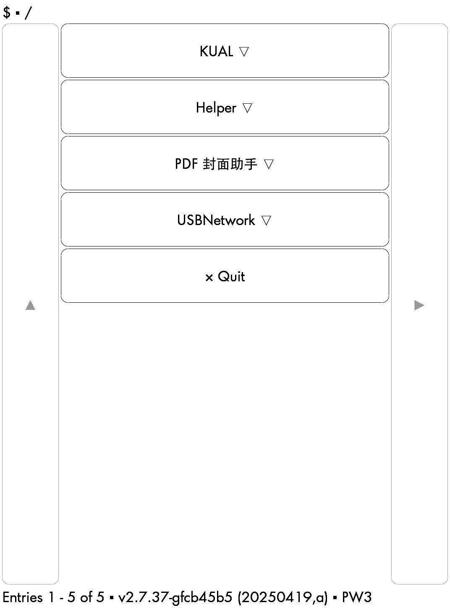
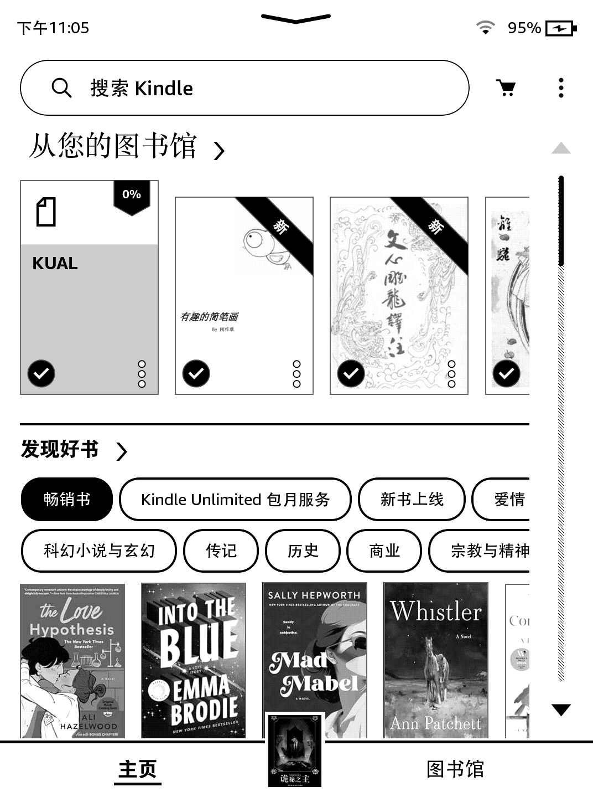

# PDF 封面助手（Kindle KUAL 插件）

> 一句话：让 Kindle 书库里的 PDF 也有封面——点一下，补齐，自动回书架。

用 Send to Kindle 推送到 Kindle 的 PDF，在书库里通常只有一个空白的灰色图标，混在一排有封面的书中间格外扎眼。对"书库整齐划一"有执念的封面党来说，这几乎不能忍。

**PDF 封面助手**就是为这个强迫症写的：KUAL 菜单里一个按钮，点一下，它自动把书库里所有本地 PDF 的第一页渲染成封面，写进 Kindle 的书库数据库，然后自动退回书库——你的 PDF 从此和商店书一样有封面。

## 效果预览

**补全前**——书库里的 PDF 只有空白的灰色图标：

**KUAL 菜单**——PDF 封面助手，一个按钮：

**补全后**——PDF 也有封面了：

## 特性

- **一个按钮**：主菜单只有"扫描并补封面"，点完自动回书库，结果直接显示在屏幕上
- **增量处理**：已有封面的书自动跳过，重复扫描不会重复劳动
- **纯本地**：无网络请求、无常驻进程、无定时任务、不额外耗电
- **不动书**：不修改 PDF 文件本身，不动阅读进度和账号数据
- **安全设计**：扫描前自动备份书库数据库；写入前检查表结构，不兼容就停下；数据库被占用时不抢锁，直接放弃
- **自带渲染引擎**：内置裁剪版 MuPDF，从 PDF 第一页渲染封面，不依赖 KOReader 等任何阅读器

## 实机验证机型

- **Kindle Oasis 2** ✅ 实机验证
- **Kindle Paperwhite 3（KPW3）** ✅ 实机验证
- **Kindle Paperwhite 4（KPW4）** ✅ 实机验证

覆盖原理：包内同时内置 `armv7`（软浮点老代）与 `kindlehf`（armhf 新代）两套裁剪运行时，启动时自动试跑并选用可用的一套；若设备装有 KOReader，也会作为兜底借用（非必需）。同平台的其他机型理论上兼容，但**未逐台实机验证，不预先承诺**——请以“高级工具 → 兼容性检查”的结果为准（不兼容时不会写数据库）。

**前置条件**：Kindle 已越狱并安装 KUAL。需要系统自带 `sqlite3` / `cjpeg` / `djpeg`（所有已越狱 Kindle 均具备）。

## 安装与使用

1. Kindle 连接电脑，把压缩包内的 `extensions/pdf-cover` 文件夹整体复制到 Kindle 根目录的 `extensions/` 下
2. 弹出设备；在 Kindle 书库里打开 KUAL（若已打开，请先完全退出再重开，让菜单重新加载）
3. 出现 **PDF 封面助手** → 点击 **扫描并补封面**
4. 自动回到书库，完成——封面已经有了

> 首次使用建议先跑一次"高级工具 → 兼容性检查"，确认环境没问题（结果会显示实际使用的运行时）。日常使用只需要第 3 步那一个按钮。

## 工作原理（给好奇的人）

1. 扫描 Kindle 书库数据库（`cc.db`），找出所有本地存在的 PDF
2. 逐个检查是否已有有效封面，有则跳过
3. 用内置 MuPDF 渲染 PDF 第一页，按 Kindle 封面尺寸居中适配
4. 转成 Kindle 缩略图并更新书库记录
5. 每轮扫描前自动把 `cc.db` 备份到 `extensions/pdf-cover/data/backups/`

## 卸载

通过 USB 删除 `extensions/pdf-cover` 文件夹即可。已生成的封面与数据库映射会保留，书库封面不会因此消失。

## 许可与致谢

- 插件脚本：AGPL-3.0
- 渲染运行时提取自 KOReader 2026.07.1 的 Kindle 构建（armv7 / kindlehf），包含 MuPDF、LuaJIT、FreeType 等组件，仅用于渲染 PDF 首页；完整许可与源码获取方式见 `LICENSE` 与 `THIRD_PARTY.md`

## 版本历史

- **0.3.0**：内置双运行时（armv7 + kindlehf），自动适配新旧代际机型；兼容性检查报告实际使用的运行时来源
- **0.2.0**：内置 armv7 独立运行时，不依赖 KOReader；主菜单精简为单个"扫描并补封面"按钮，低频操作收入"高级工具"
